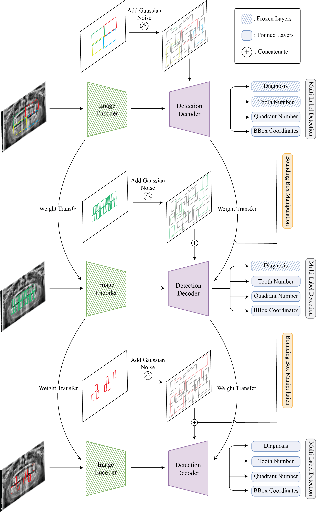

# HierarchicalDet: Diffusion-Based Hierarchical Multi-Label Object Detection to Analyze Panoramic Dental X-rays
Diffusion-Based Hierarchical Multi-Label Object Detection to Analyze Panoramic Dental X-rays


*Our method relies on a hierarchical learning approach utilizing a combi- nation of multi-label detection, bounding box manipulation, and weight transfer.*


*Output from our final model showing well-defined boxes for diseased teeth with corresponding quadrant (Q), enumeration (N), and diagnosis (D) labels.*

<details><summary>Table of Contents</summary><p>

* [What is VerSe?](#what-is-verse)
* [Citing VerSe](#citing-verse)
* [Data](#data)
* [Download](#download)
* [License](#license)
* [Code](#code)
* [Contact](#contact)
* [Other Related Work](#other-related-work)
* [Acknowledgements](#acknowledgements)

</p></details><p></p>

## What is VerSe?
Spine or vertebral segmentation is a crucial step in all applications regarding automated quantification of spinal morphology and pathology. With the advent of deep learning, for such a task on computed tomography (CT) scans, a big and varied data is a primary sought-after resource. However, a large-scale, public dataset is currently unavailable.

We believe *VerSe* can help here. VerSe is a large scale, multi-detector, multi-site, CT spine dataset consisting of 374 scans from 355 patients. The challenge was held in two iterations in conjunction with MICCAI 2019 and 2020. The tasks evaluated for include: vertebral labelling and segmentation.  

## Citing VerSe

If you use VerSe, we would appreciate references to the following papers. 

1. **Sekuboyina A et al., VerSe: A Vertebrae Labelling and Segmentation Benchmark for Multi-detector CT Images, 2021.**<br />In Medical Image Analysis: https://doi.org/10.1016/j.media.2021.102166<br />Pre-print: https://arxiv.org/abs/2001.09193

2. **Löffler M et al., A Vertebral Segmentation Dataset with Fracture Grading. Radiology: Artificial Intelligence, 2020.**<br />In Radiology AI: https://doi.org/10.1148/ryai.2020190138

3. **Liebl H and Schinz D et al., A Computed Tomography Vertebral Segmentation Dataset with Anatomical Variations and Multi-Vendor Scanner Data, 2021.**<br />Pre-print: https://arxiv.org/pdf/2103.06360.pdf


## Data

* The dataset has four files corresponding to one data sample: image, segmentation mask, centroid annotations, a PNG overview of the annotations.

* Data structure 
    - 01_training - Train data
    - 02_validation - (Formerly) PUBLIC test data
    - 03_test - (Formerly) HIDDEN test data

* Sub-directory-based arrangement for each patient. File names are constructed of entities, a suffix and a file extension following the conventions of the Brain Imaging Data Structure (BIDS; https://bids.neuroimaging.io/)

```
Example:
-------
training/rawdata/sub-verse000
    sub-verse000_dir-orient_ct.nii.gz - CT image series

training/derivatives/sub-verse000/
    sub-verse000_dir-orient_seg-vert_msk.nii.gz - Segmentation mask of the vertebrae
    sub-verse000_dir-orient_seg-subreg_ctd.json - Centroid coordinates in image space
    sub-verse000_dir-orient_seg-vert_snp.png - Preview reformations of the annotated CT data.

```


* Centroid coordinates of the subject based structure (.json file) are given in voxels in the image space. 'label' corresponds to the vertebral label: 
    - 1-7: cervical spine: C1-C7 
    - 8-19: thoracic spine: T1-T12 
    - 20-25: lumbar spine: L1-L6 
    - 26: sacrum - not labeled in this dataset 
    - 27: cocygis - not labeled in this dataset 
    - 28: additional 13th thoracic vertebra, T13


## Download

### WGET:

1. (VerSe'19) https://s3.bonescreen.de/public/VerSe-complete/dataset-verse19training.zip
2. (VerSe'19) https://s3.bonescreen.de/public/VerSe-complete/dataset-verse19validation.zip
3. (VerSe'19) https://s3.bonescreen.de/public/VerSe-complete/dataset-verse19test.zip

4. (VerSe'20) https://s3.bonescreen.de/public/VerSe-complete/dataset-verse20training.zip
5. (VerSe'20) https://s3.bonescreen.de/public/VerSe-complete/dataset-verse20validation.zip
6. (VerSe'20) https://s3.bonescreen.de/public/VerSe-complete/dataset-verse20test.zip

### OSF Reporsitories:

1. VerSe'19: https://osf.io/nqjyw/
2. VerSe'20: https://osf.io/t98fz/

**Note**: The annotation format of the complete VerSe data is **NOT** identical to the one used for the MICCAI challenges. The OSF repositories above also point to the MICCAI version of the data and annotations. Nonetheless, **we recommend usage of the restructured data and annotations**

## License
The data is provided under the [CC BY-SA 4.0 License](https://creativecommons.org/licenses/by-sa/4.0/), making it fully open-sourced.

The rest of this repository is under the [MIT License](https://choosealicense.com/licenses/mit/).

## Code

We provide helper code and guiding notebooks.

* Data reading, standardising, and writing: [Data utilities](https://github.com/anjany/verse/blob/main/utils/data_utilities.py)
* Evaluation (as employed in the 2020 challenge): [Evaluation utilities](https://github.com/anjany/verse/blob/main/utils/eval_utilities.py)  
* Notebooks: [Data preperation](https://github.com/anjany/verse/blob/main/utils/prepare_data.ipynb), [Evaluation](https://github.com/anjany/verse/blob/main/utils/evaluate.ipynb)

## Contact
For queries and issues not fit for a github issue, please email [Anjany Sekuboyina](mailto:anjany.sekuboyina@tum.de) or [Jan Kirschke](mailto:jan.kirschke@tum.de) .


## Other Related Work

VerSe has resulted in numerous other publications. Below are a few selected ones.

**Sekuboyina A. et al., Labelling Vertebrae with 2D Reformations of Multidetector CT Images: An Adversarial Approach for Incorporating Prior Knowledge of Spine Anatomy. Radiology: Artificial Intelligence, 2020.** (https://doi.org/10.1148/ryai.2020190074)


## Acknowledgements
* This work is supported by the European Research Council (ERC) under the European Union’s ‘Horizon2020’  research  &  innovation  programme  (GA637164–iBack–ERC–2014–STG).
* We thank NVIDIA for the support in challenge organisation with compute. 
* README derived from [PCam](https://github.com/basveeling/pcam).
